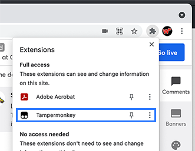
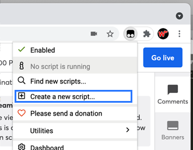

# StreamYardKeys
Automate switching camera angles and video/audio mute on the Streamyard video streaming service

- Use [Chrome](https://www.google.co.uk/chrome/).
- Install the [TamperMonkey](https://chrome.google.com/webstore/detail/tampermonkey/dhdgffkkebhmkfjojejmpbldmpobfkfo) Chrome extension.
- Open the [StreamYard](https://streamyard.com/) website, log into your StreamYard account and open a new broadcast. There is no need to go live.
- Select TamperMonkey from the extension menu top right on Chrome.

- Select 'Create New Script' from the TamperMonkey menu.

